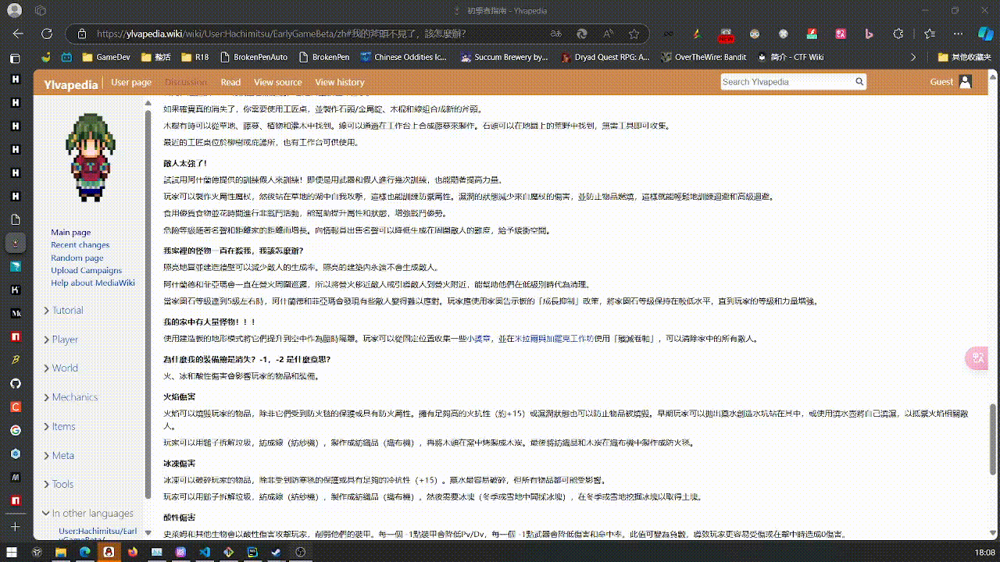

# 🖋️ 言阅姬 (YanYueJi)

Steam 好评率98%，全球首款「寻找对话中敏感词」的游戏《ウーマンコミュニケーション/ 女性交流》通关后做的小玩具，既可以直接标红页面上的敏感词，也可以人工寻找敏感词并点击以标红。

## 🚀 快速开始

### 📥 下载书签

1. **下载项目**
   ```bash
   git clone https://github.com/Laurence-042/my-pen-is-broken.git
   cd my-pen-is-broken
   npm install
   ```

2. **构建书签**
   ```bash
   npm run build
   ```

3. **使用书签**
   - 打开生成的 `dist/bookmarks.html` 文件
   - 右键点击对应的书签链接，选择"添加到书签"
   - 在任意网页上点击书签即可使用

### 🎯 两种模式

| 模式 | 功能 | 适用场景 |
|------|------|----------|
| **🤖 自动检测版** | 加载后立即扫描并高亮所有敏感词 | 快速扫描，批量检测 |
| **👆 手动点击版** | 点击文字才检测敏感词并显示拼音 | 精确检测，逐个确认 |

## 🖼️ 使用示例



## ⚠️ 已知限制

- **DoubleShot 重叠问题**: 当两个敏感词重叠时，自动模式只会标记其中一个，手动模式可以标记多个
- **拼音相同词汇重复计数**: 敏感词库中拼音相同的词会被分别计数，导致统计数量可能偏高

## 🛠️ 开发

### 项目结构
```
my-pen-is-broken/
├── src/
│   ├── index.js              # 核心逻辑
│   └── index.html            # HTML模板
├── scripts/
│   └── build-bookmarklets.js # 书签构建脚本
├── dist/
│   ├── bookmarks.html        # 书签使用页面
│   └── bookmarklets/         # 生成的书签文件
└── webpack配置文件...
```

### NPM 脚本
```bash
npm run build    # 构建书签版本
npm run start    # 启动开发服务器
npm run watch    # 监听文件变化
```

### 技术实现
- **拼音转换**: 使用 `pinyin` 库将中文转换为拼音进行模糊匹配
- **DOM 操作**: 遍历页面文本节点，替换匹配的敏感词为高亮元素
- **敏感词库**: 从远程GitHub仓库获取GBK编码的敏感词列表
- **构建系统**: 使用Webpack打包，支持自动/手动两种模式

## 📚 外部依赖

- **敏感词库**: [57ing/Sensitive-word](https://github.com/57ing/Sensitive-word/blob/master/%E8%89%B2%E6%83%85%E8%AF%8D%E5%BA%93.txt)
- **拼音转换**: [pinyin](https://www.npmjs.com/package/pinyin) 库
- **构建工具**: Webpack + Babel

## 📄 更多信息

- 详细构建说明: [BUILD_GUIDE.md](./BUILD_GUIDE.md)
- 项目许可证: [LICENSE](./LICENSE)

## 🤝 贡献

欢迎提交Issue和Pull Request来改进这个项目！
